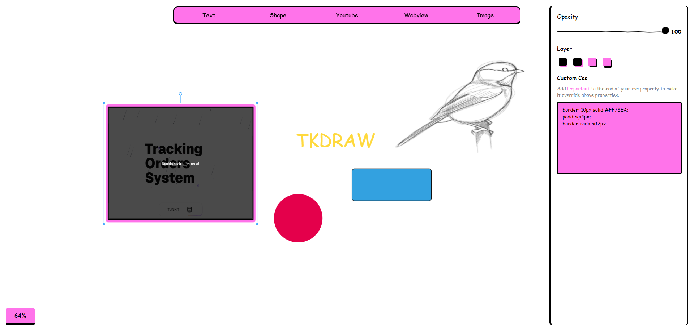

# tkdraw



**tkdraw** is a lightweight, browser-based infinite-canvas whiteboard. Drop text, shapes, images, YouTube videos, and live embedded websites onto a pannable, zoomable canvas, then style each element with a floating property panel — including raw custom CSS for full control.

## Features

- **Infinite pannable & zoomable canvas**, with a live zoom percentage indicator
- **Drag, resize, rotate, and scale** any element freely.
- **Five element types**, each placed straight from the toolbar:
  - **Text** — click to place, double-click to edit inline, with font family, text color, and background controls.
  - **Shape** — drag out a box or a circle.
  - **Image** — drag out a box and paste in an image URL.
  - **Youtube** — drag out a box and paste in a YouTube link to embed a player.
  - **Webview** — drag out a box and paste in any URL to embed a live iframe (double-click to interact with the embedded page).
- **Per-element property panel** with:
  - Opacity slider
  - Color / background / border swatches plus a full color picker
  - Layer control (send to back, send behind, bring forward, bring to front)

### Custom CSS, on every element

Every element on the canvas comes with its own **Custom CSS editor** in the property panel — a free-text box where you can write raw CSS rules that apply directly to the selected element. This means you're never limited to the built-in opacity/color/border controls: if you can write it in CSS, you can apply it. Add `!important` to any property to override the built-in styling controls as well. It's the escape hatch that turns tkdraw from a simple shape tool into something as flexible as hand-written CSS.

## Getting started

```bash
npm install
npm run dev
```

This starts the dev server. Open the printed local URL in your browser, pick a tool from the toolbar, and start drawing.

## Contributing

Issues and pull requests are welcome.

## License

[MIT](./LICENSE) — free to use, modify, and distribute, including for commercial purposes.
